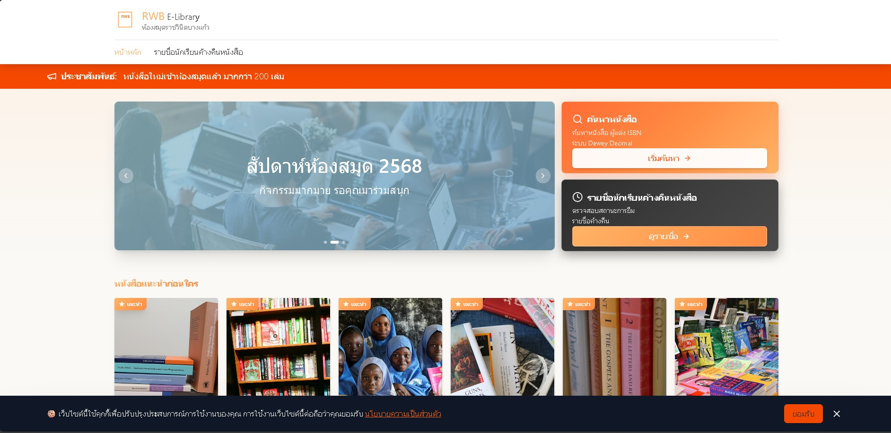
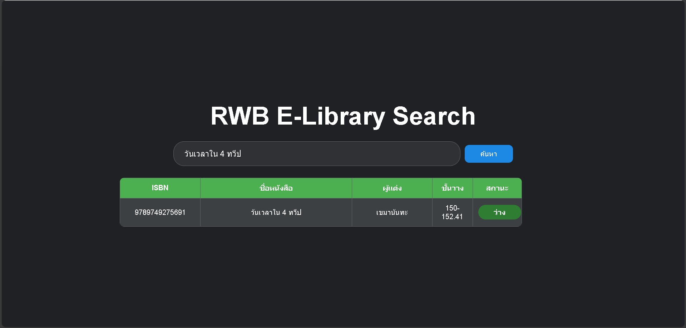
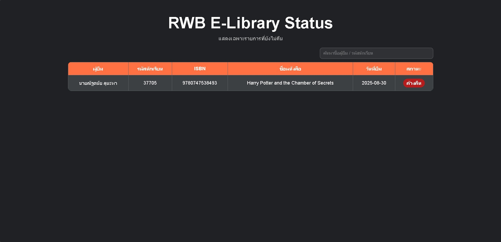

# 📚 RWB E-Library – Web Application (Software Architecture Overview)

RWB E-Library is a **web-based library system** developed as an academic and portfolio project.  
The project demonstrates how a modern frontend web application can be integrated with **Google Apps Script** as a backend service and **Google Sheets** as a lightweight database.

The system is designed to be simple, practical, and easy to maintain using cloud-based technologies.

🔗 **UI/UX Design Reference (Figma):**  
https://www.figma.com/design/GDxoyV4NfNp33Hpsf5x2ZO/RWB-E-Library-Design-Prototype

---

## 🧠 Software Architecture Overview

The application is structured using a **three-layer architecture**:

1. **Frontend** – Web-based user interface  
2. **Backend** – API service using Google Apps Script  
3. **Database** – Data storage using Google Sheets  

Each layer has a clear responsibility and communicates using HTTP requests with JSON data.

---

## 🖥️ Frontend Technology

The frontend is developed as a **Single Page Application (SPA)**.

### Tools & Technologies
- **React**  
  Used to build reusable UI components and manage application state efficiently.

- **Vite**  
  Serves as the development server and build tool, providing fast hot reload and optimized builds.

- **JavaScript (ES6+)**  
  Handles application logic, API communication, and dynamic rendering.

- **CSS / Component-based Styling**  
  Used to implement responsive layouts and a clean, modern design aligned with the Figma prototype.

### Frontend Responsibilities
- Render book listings and UI pages  
- Handle user input and interactions  
- Communicate with the backend API  
- Display dynamic data from the backend  

---

## ⚙️ Backend Technology

The backend is implemented using **Google Apps Script**, deployed as a **Web App**.

### Backend Characteristics
- Written in JavaScript
- Acts as a REST-like API
- Handles requests from the frontend
- Processes data and basic business logic
- Reads and writes data to Google Sheets
- Returns responses in JSON format

### Why Google Apps Script?
- No server setup required
- Seamless integration with Google services
- Suitable for small-scale systems and educational projects
- Easy deployment and maintenance

---

## 🗄️ Database Technology

The system uses **Google Sheets** as a lightweight database solution.

### Database Design Concept
- Each sheet represents a table (e.g. Books, BorrowRecords)
- Rows represent records
- Columns represent fields

### Advantages
- Simple and easy to manage
- No additional database infrastructure required
- Ideal for prototypes and portfolio projects

### Limitations
- Not suitable for large-scale or high-concurrency systems
- Limited compared to traditional databases

---

## 🖼️ Screenshots (UI Preview)

### 1️⃣ Home / Book List Page

### 2️⃣ Book Search / Book Status

### 3️⃣ List of Book Borrowers Page

---

## 🛠️ Technology Stack Summary

### Frontend
- React  
- Vite  
- JavaScript  
- CSS  

### Backend
- Google Apps Script (Web App)

### Database
- Google Sheets

---

## 🎯 Project Purpose

This project was created to:
- Demonstrate frontend development skills using React
- Show integration between frontend and Google-based backend services
- Present a complete but lightweight web application architecture
- Serve as a portfolio-ready software project

---

⭐ *This project showcases the ability to design, build, and integrate frontend and backend systems using accessible cloud technologies.*
